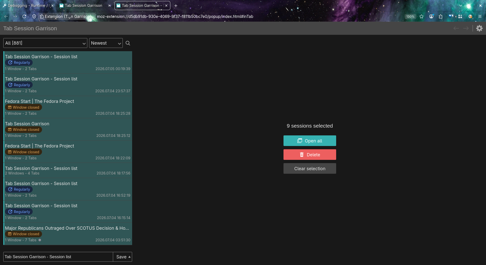
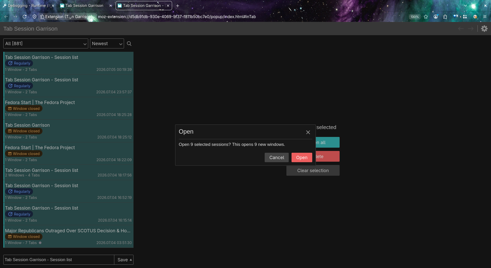
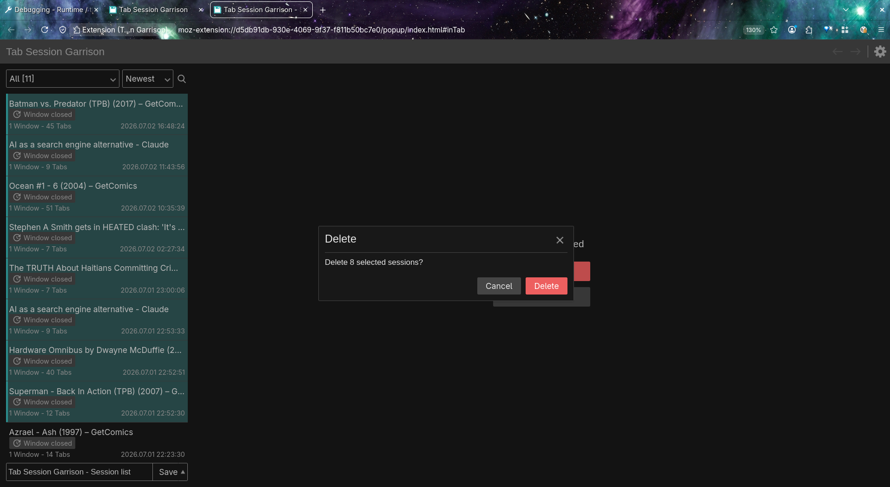
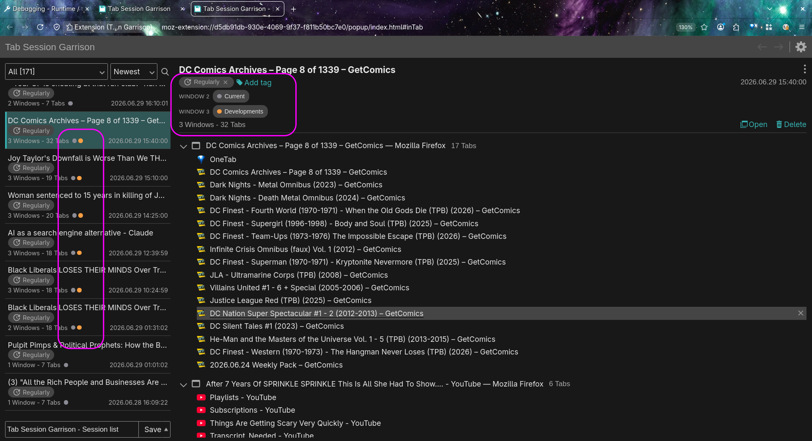
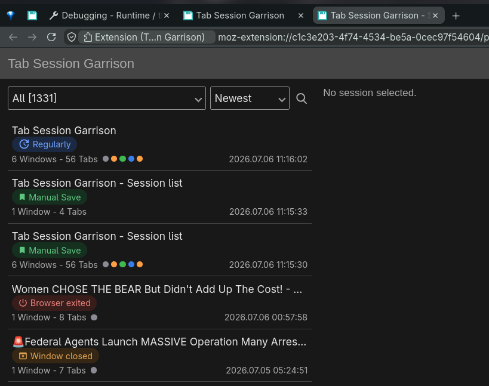

# <sub></sub> Tab Session Garrison

**Keyboard-first session management for Firefox.** Save and restore windows and tabs — with fast multi-select, full keyboard navigation, and tab-group awareness for wrangling large numbers of saved sessions.



> _Using the original Tab Session Manager icon for now — its own logo is on the roadmap._

Tab Session Garrison is a personal fork of [**Tab Session Manager**](https://github.com/sienori/Tab-Session-Manager) by Sienori, focused on power-user controls: selecting, navigating, restoring, and deleting sessions without leaving the keyboard — and clearing out the noise that builds up when you auto-save constantly.

---

## Features

Everything Tab Session Manager does — save and restore the state of windows and tabs, automatic timed saving, tagging, search, import/export, and native tab-group save/restore — **plus:**

### Selection & bulk actions

- **Multi-select** sessions with Ctrl/Cmd-click, Shift-click ranges, or the keyboard
- **Full keyboard navigation** of the list — move, extend, select-all, restore, and delete without touching the mouse
- **Bulk delete** with a single **"undo all"** — clear out dozens of stale auto-saves at once, and still get them back if you misclick
- **Bulk restore** — open every selected session at once, each in its own new window (with a confirm so a stray keypress doesn't flood your screen)
- An **"N selected" summary** panel — with **Open all** and **Delete** actions — so you always know what a bulk action will hit





### Tab groups

- **Group indicators** — every session shows its Firefox tab groups at a glance: colored, named chips **grouped by window** in the detail pane, and colored dots on each list row
- **Add a session to your current window as a tab group** — drop a saved session's tabs into the window you're in, tidied into one named group (and it preserves the session's own groups when it already has them)
- **Phantom-group masking** — older auto-saves that captured stray groups from other windows are cleaned up at display time, non-destructively



### Reliability & polish

- **Durable auto-save** — fixes an upstream bug where periodic auto-save could silently stop after the browser suspended or restarted; the alarm now self-heals
- **Session types at a glance** — every session shows how it was saved, each with its own icon and tint: **Manual Save** (green bookmark), **Regularly** (blue clock), **Window closed** (amber window), **Browser exited** (red power). The saves you deliberately keep finally stand out from the auto-save noise (see [How a session gets its type](#how-a-session-gets-its-type))
- **Cleaner, consistent UI** — rounded pill tags and group chips, theme-aware colors

### How a session gets its type

Every session is one of four types, shown as a coloured pill:

| Pill | Meaning |
|---|---|
| 📑 **Manual Save** (green) | You saved it yourself — the **Save** button or the keyboard shortcut |
| **Regularly** (blue) | The timed auto-save |
| **Window closed** (amber) | Captured automatically when you closed a window |
| **Browser exited** (red) | Captured automatically when Firefox last quit |

The three automatic types carry a stored marker, so they're always exact. **Manual Save** is stamped on every save you make from now on. For older sessions saved before this feature — and for anything **imported** or **cloud-restored** that arrived without a type — it's _inferred_ from the absence of an auto-save marker. In practice that inference is accurate: a session you manually saved in Tab Session Manager and imported here still reads as a Manual Save. The type pills are descriptors, not labels, so they can't be removed — but your own custom tags still can.



### Keyboard & selection reference

| Input | Action |
|---|---|
| Click | Select one session |
| Ctrl/Cmd + Click | Toggle one session in/out of the selection |
| Shift + Click | Select the range from the anchor to the clicked row |
| ↑ / ↓ | Move the selection |
| Shift + ↑ / ↓ | Extend the selection |
| Space | Toggle the focused row |
| Ctrl/Cmd + A | Select all visible sessions (respects filter/search) |
| Delete / Backspace | Delete the selection (confirms when more than one) |
| Esc | Collapse back to a single selection |
| Enter / Shift + Enter | Restore the selection — one session directly, or several each in their own new window (confirms first) |

---

## Status

This is a **personal fork**, built and used on **Firefox (Linux)**. A few things to know:

- **Firefox only, for now.** This fork targets Firefox and nothing else; Chrome/Edge may come later. If you need those today, the [original Tab Session Manager](https://addons.mozilla.org/firefox/addon/tab-session-manager/) is on the Firefox, Chrome, and Edge stores.
- **Not on the add-on stores.** You install it yourself (below).
- **Cloud sync is disabled** in local builds — it relies on API keys that aren't part of the source. Local saving, restoring, auto-save, and everything above work normally.
- **No telemetry.** Sessions are stored by the browser, on your machine.

---

## Installing

### Try it (temporary)

1. Build it (see [Developing](#developing)), or use an existing `dev/firefox` build.
2. Firefox → `about:debugging#/runtime/this-firefox` → **Load Temporary Add-on** → pick `manifest.json` inside `dev/firefox`.

Temporary add-ons unload when Firefox restarts.

### Keep it (permanent)

Firefox won't permanently install an unsigned extension, so sign it through Mozilla as an **unlisted** (self-distributed) add-on — automated, free, and it keeps your normal Firefox:

```bash
npm install -g web-ext
cd dev/firefox
web-ext sign --channel=unlisted --api-key="user:XXXX:YY" --api-secret="ZZZZ"
```

Then install the resulting `.xpi` via `about:addons` → ⚙ → **Install Add-on From File**. (API keys come from AMO → Developer Hub → *Manage API Keys*.)

---

## Developing

> Target: Node 24.13.0 / npm 11.7.0 — builds fine on Node 22+ with a harmless engine warning.

```bash
git clone https://github.com/superuser-miguel/Tab-Session-Garrison
cd Tab-Session-Garrison

# Cloud-sync credentials are gitignored and absent from the repo.
# A stub lets the build complete (cloud sync stays off locally):
printf 'export const clientId = "";\nexport const clientSecret = "";\n' > src/credentials.js

npm install
npm run watch-dev      # rebuilds on save; output lands in dev/firefox
```

Load `dev/firefox/manifest.json` via **about:debugging** (see [Installing](#installing)).

---

## Roadmap

**In progress**

- **Backup overhaul** — the original backup was a single confusing toggle that dumped one unpruned file per auto-save (tens of thousands of them, forever). Replacing it with a clear **three-tier engine**, all under the download folder, that **never deletes your history** and uses **zip compression** to manage space instead:
  - **Complete** — a full, compressed snapshot of every session, kept indefinitely for disaster recovery _(built)_
  - **Session** — one file per saved session, updated in place _(next)_
  - **Incremental** — append-only point-in-time history of auto-saves; recent snapshots stay as loose, browsable files and older ones roll up into zips once a date/size threshold is hit _(next)_
  - **Restore-from-backup UI** — browse and restore snapshots without hand-importing files _(after the engine)_
- **Tab Groups polish** — group save/restore, on-demand grouping, and visual indicators are in; still hardening edge cases (restoring into windows that already have groups, multi-window merges)

**Planned**

- **Firefox Split View** — _investigated (Jul 2026):_ Firefox **does** expose split state (each tab carries a `splitViewId`), and Tab Session Garrison already **captures** it when you save. **Restoring** a split isn't possible yet — Firefox has no API to _create_ a split from an extension ([bug 2016928](https://bugzilla.mozilla.org/show_bug.cgi?id=2016928) / [WECG #967](https://github.com/w3c/webextensions/issues/967)). Once that ships, restore drops in with no re-work
- **Fast list loading** — the popup currently deserializes every full session record (favicons and all) just to paint the list, so a large profile is slow to open. Rebuild the load path to be genuinely fast on thousands of sessions — a lightweight index the list reads from, with heavy records fetched only on selection, plus lazy/off-thread loading where it helps
- **Trash can** — deleted sessions go to a recoverable trash instead of vanishing once the undo window passes; restore or empty it on your terms
- **UI refresh** — a less utilitarian popup layout, and finishing the popup that follows Firefox's active theme colors
- **Duplicate cleanup** — collapse the near-identical snapshots that pile up from frequent auto-saving
- **Own branding** — logo, icons, and screenshots of its own
- **Chrome / Edge** — possibly, further down the line

---

## Credit

Tab Session Garrison stands entirely on [**Tab Session Manager**](https://github.com/sienori/Tab-Session-Manager) by **Sienori** (forked at v7.3.0) — all of the core functionality is theirs. If you want a polished, signed, cross-browser, actively maintained session manager, install the original and **[support Sienori's work](https://www.patreon.com/sienori)**. This fork just adds keyboard ergonomics and tab-group niceties on top.

## License

Tab Session Garrison is free software, licensed under the **[GNU General Public License v3.0 or later](LICENSE)**.

It's a fork of [Tab Session Manager](https://github.com/sienori/Tab-Session-Manager) © 2017– Sienori, originally released under the **Mozilla Public License 2.0**. Because the upstream code carries no "Incompatible With Secondary Licenses" notice, MPL-2.0 permits this fork to be distributed under the GPL. Sienori's copyright and the original MPL-2.0 text are preserved in **[LICENSE.MPL](LICENSE.MPL)**, and the MPL-covered portions remain available under MPL-2.0 as well.

- Upstream code: © 2017– Sienori — MPL-2.0 (see [LICENSE.MPL](LICENSE.MPL))
- This fork's changes: © 2026 superuser-miguel — GPL-3.0-or-later
